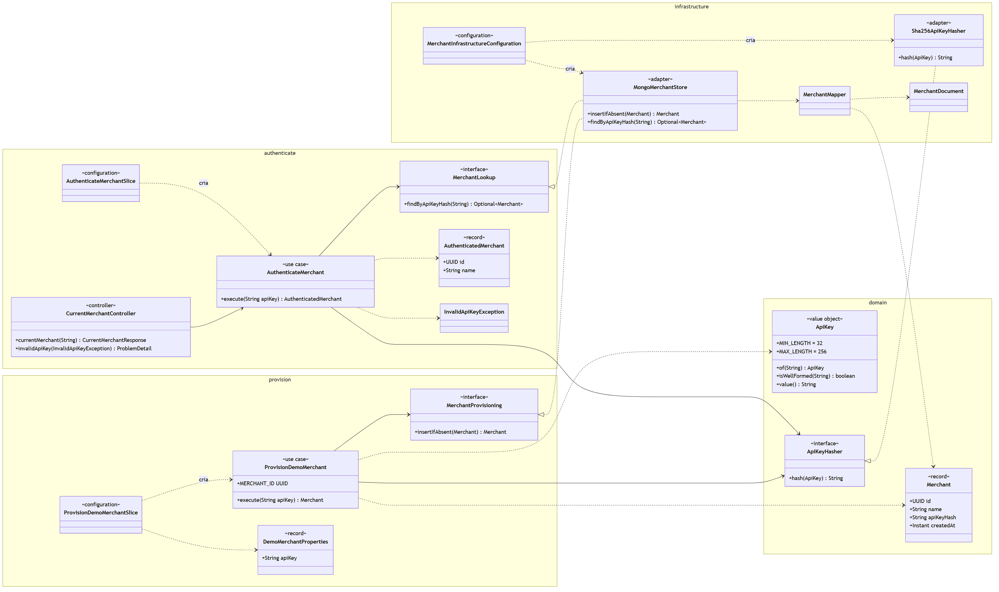
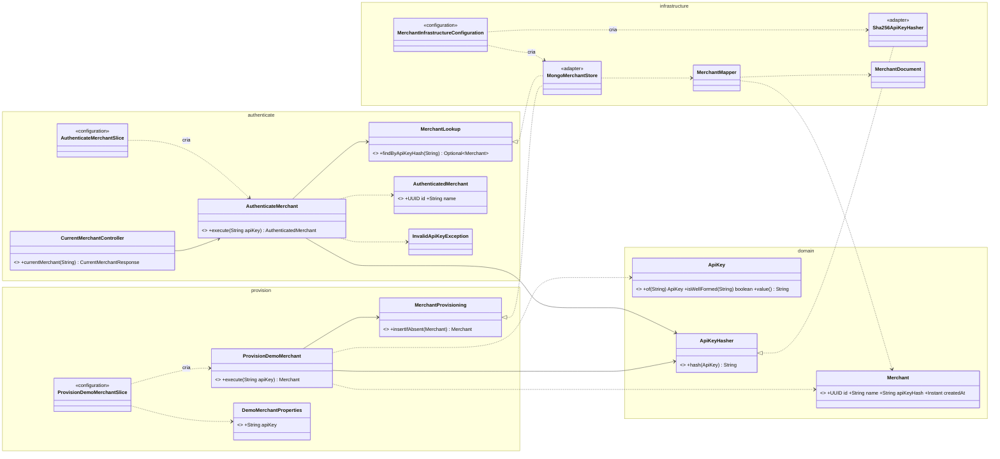
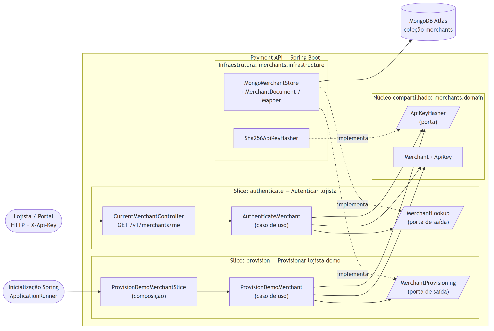
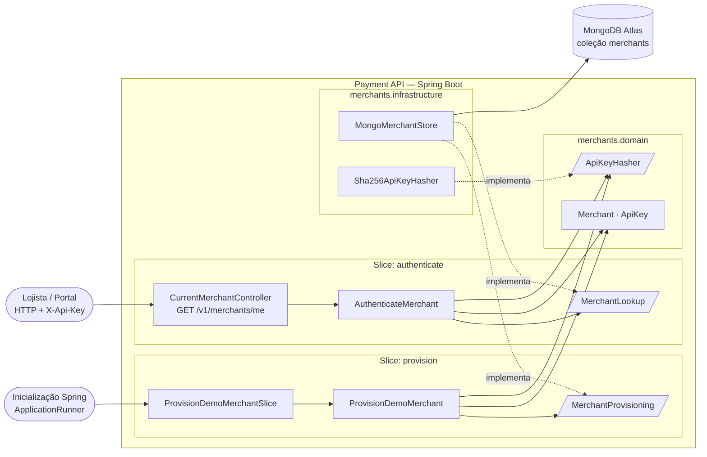

# PayFlow — Arquitetura do backend (Vertical Slice + Clean Architecture + SOLID)

Branch: `feature/vertical-slice-solid` — https://github.com/CaioSeniuk/PayFlow/tree/feature/vertical-slice-solid

## Funcionalidades implementadas como fatias verticais

| Slice | Pacote | Gatilho | Comportamento |
|---|---|---|---|
| Provisionar lojista demo | `merchants.provision` | `ApplicationRunner` na inicialização (`payflow.demo-merchant.enabled=true`) | Valida a API Key (32–256 caracteres), grava apenas o hash SHA-256 de forma atômica (upsert) e falha se o lojista já existir com outra chave |
| Autenticar lojista | `merchants.authenticate` | `GET /v1/merchants/me` com cabeçalho `X-Api-Key` | Retorna `id` e `name` do lojista; chave ausente, malformada ou desconhecida responde `401` com Problem Details e `WWW-Authenticate` |

As duas fatias são as primeiras do plano do MVP (Etapa 1 e primeiro item da Etapa 2) e servem de base para as futuras fatias de pagamento, que dependerão da autenticação.

## Estrutura de pacotes

```text
br.com.payflow.payment
└── merchants/                         módulo de negócio (lojistas)
    ├── domain/                        núcleo compartilhado, sem frameworks
    │   ├── Merchant                   entidade (record) com invariantes
    │   ├── ApiKey                     value object; mascara o valor em toString
    │   └── ApiKeyHasher               porta (interface) de hash
    ├── provision/                     SLICE 1 — Provisionar lojista demo
    │   ├── ProvisionDemoMerchant      caso de uso
    │   ├── MerchantProvisioning       porta de saída (insertIfAbsent)
    │   ├── DemoMerchantProperties     configuração da fatia
    │   └── ProvisionDemoMerchantSlice composição Spring + gatilho de inicialização
    ├── authenticate/                  SLICE 2 — Autenticar lojista
    │   ├── AuthenticateMerchant       caso de uso
    │   ├── MerchantLookup             porta de saída (findByApiKeyHash)
    │   ├── AuthenticatedMerchant      saída do caso de uso (sem credenciais)
    │   ├── InvalidApiKeyException     erro único para não revelar o motivo
    │   ├── CurrentMerchantController  adaptador HTTP GET /v1/merchants/me
    │   └── AuthenticateMerchantSlice  composição Spring
    └── infrastructure/                adaptadores
        ├── MerchantInfrastructureConfiguration  liga portas a adaptadores + índice único
        ├── crypto/Sha256ApiKeyHasher
        └── mongodb/MongoMerchantStore, MerchantDocument, MerchantMapper, SpringDataMerchantRepository
```

## Regras de dependência

- Uma fatia não depende de outra (`provision` ⟂ `authenticate`).
- `domain` não depende de Spring, Jakarta, MongoDB nem das fatias.
- Casos de uso e portas não importam frameworks; somente `*Slice`, `*Controller` e `*Properties` conhecem o Spring.
- As fatias nunca referenciam `infrastructure`; a infraestrutura implementa as portas das fatias (inversão de dependência).

Essas regras são verificadas automaticamente por `ArchitectureTests` (ArchUnit).

## Diagrama de classes





Fonte completa: [`diagramas/classes.mmd`](diagramas/classes.mmd).

## Diagrama de componentes





Fonte completa: [`diagramas/componentes.mmd`](diagramas/componentes.mmd).

## Clean Architecture

| Camada | Elementos | Depende de |
|---|---|---|
| Entidades | `Merchant`, `ApiKey` | apenas JDK |
| Casos de uso | `ProvisionDemoMerchant`, `AuthenticateMerchant`, portas `MerchantProvisioning`, `MerchantLookup`, `ApiKeyHasher` | entidades |
| Adaptadores de interface | `CurrentMerchantController`, gatilho `ApplicationRunner` | casos de uso |
| Frameworks e drivers | `MongoMerchantStore`, `Sha256ApiKeyHasher`, configurações Spring | portas e entidades |

As dependências apontam sempre para dentro; o núcleo é testado sem Spring nem banco.

## SOLID aplicado

| Princípio | Onde |
|---|---|
| **S** — Responsabilidade única | Hash extraído do caso de uso para `ApiKeyHasher`/`Sha256ApiKeyHasher`; validação da chave em `ApiKey`; controller só traduz HTTP; cada `*Slice` só compõe sua fatia |
| **O** — Aberto/fechado | Nova fatia = novo pacote com caso de uso, porta e composição, sem alterar as existentes; trocar SHA-256 por outro algoritmo = nova implementação de `ApiKeyHasher` |
| **L** — Substituição de Liskov | Testes substituem as portas por lambdas e o caso de uso mantém o contrato; `MongoMerchantStore` cumpre as duas portas sem enfraquecer pré-condições |
| **I** — Segregação de interfaces | O antigo `MerchantStore` foi dividido em `MerchantProvisioning` (escrita) e `MerchantLookup` (leitura); cada fatia vê apenas o método que usa |
| **D** — Inversão de dependência | Casos de uso dependem de abstrações (portas); a infraestrutura as implementa e o Spring injeta via classes `*Slice` e `MerchantInfrastructureConfiguration` |

## Validação

Executado em 05/10/2026 no Windows 11, JDK 21, com `./mvnw verify`:

- 6 testes unitários de `ProvisionDemoMerchant`, 4 de `AuthenticateMerchant`, 2 de `Sha256ApiKeyHasher`;
- 4 testes de arquitetura (ArchUnit);
- 7 testes de integração com MongoDB 8 via Testcontainers, incluindo `GET /v1/merchants/me` com chave válida (200) e ausente/malformada/desconhecida (401).

Total: 23 testes, 0 falhas.
